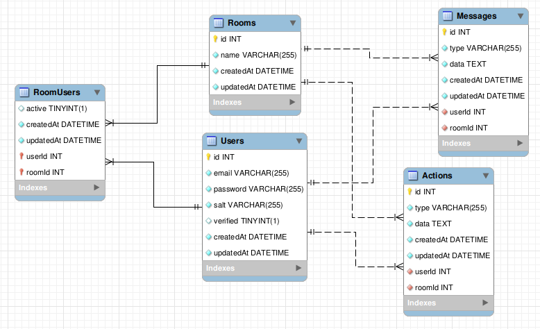

# Fun Drawing Room

## Clarify Requirements

### 1. Functional Requirements:

Collaborative Whiteboard:
- 30 users max per room.
- Real-time drawing collaboration.
- Changes should be visible to all users in real-time.

Real-Time Chat:
- Chat feature within each room.
- Support for both text and image messages.

Room Management:
- Users can create, join, and leave rooms.
- Persistent room sessions (past whiteboard states should be saved and retrievable).

Authentication:
- Verification user by email.
- JWT-based user authentication.

Non-Functional Requirements:
- Low Latency: Real-time collaboration should feel instantaneous with minimal lag.
- Scalability: Should handle multiple rooms with up to 30 users each.
- Security: Secure storage and communication (TLS, encrypted data).

### 2. Back-of-the-Envelope Estimation:

Users and Rooms:
Max users per room: 30
- Rooms: Assume 150 active rooms at peak time.
    - Total users = 150 rooms * 30 users = 4500 concurrent users.

Data Estimation:
- Whiteboard data per room (active session): Assume each action (e.g., drawing a line, adding text) is around 1 KB.
    - Average of 1000 actions per session: 1000 KB or ~1 MB per active session.
    - 150 rooms * 1 MB = 150 MB of whiteboard data in memory.
- Chat Messages:
    - Average message size (text): 100 bytes.
    - Assume 2000 messages per session.
    - Storage: 2000 messages * 100 bytes = 200 KB per session for text chat.
    - If 20% of messages include images (100 KB each): 400 images * 100 KB = 40 MB for images per session.
    - Total chat data per room: ~50 MB.
    - For 150 rooms: 150 rooms * 50 MB = 7500 MB of chat data.

Traffic:
- WebSocket Messages:
    - Assume each user performs 10 actions/minute.
    - For 30 users: 30 * 10 = 300 actions/minute per room.
    - 150 rooms: 150 * 300 = 45000 WebSocket messages per minute (~5000 messages per second).
- Data Storage:
    - If we store chat and whiteboard data for sessions: around 50 GB/day.

### 3. APIs Design

Authentication APIs:
- POST /api/v1.0/sign-in: Authenticate users.
- POST /api/v1.0/sign-up: Register a new user.
- POST /api/v1.0/verify: Verify a new user via email.
- POST /api/v1.0/reset-password: Reset user's password via email.
- POST /api/v1.0/change-password: Change user's password.

Room Management APIs:
- GET /room: Get list rooms.
- POST /room: Create a new room.
- POST /room/join: Join an existing room.
- POST /room/leave: Leave an existing room.

Whiteboard APIs:
- POST /whiteboard/action: Broadcast whiteboard actions.
- GET /whiteboard: Retrieve saved whiteboard state.

Chat APIs:
- POST /message: Send a text message.
- POST /file: Send a file message.

### 4. Data Model Design

### 5. High-Level Design

Frontend: Web-based interface for whiteboard and chat (React).

Backend: Node.js with Express for handling API requests and WebSocket server for real-time communication.

Database: MySQL for structured data.

Cache: Redis for caching data.

Message Queue: Kafka to handle event streaming and message queuing. (Not implemented yet)

File Storage: GCP Buckets for storing files.
